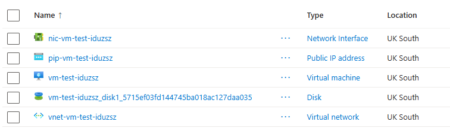

# OVERVIEW

This solution will deploy an Azure Linux Virtual Machine (Ubuntu) and its required network dependencies into an existing Resource Group.



It ignores various Tags auto-applied via Policy:

- Atlas_Project
- Capability
- Deployment-date
- OwnerEmailAddress
- Project
- Team

# PRE-REQS

- An existing Azure Resource Group.
- Visual Studio Code, Terraform, Azure CLI.
- An existing SSH key pair on your machine (`~/.ssh/id_rsa.pub`). If you do not have one, see [Generating SSH Keys](#generating-ssh-keys).

# GETTING STARTED

1. Clone this repository and open the folder in your terminal.
2. Log in to your Azure account:
   ```bash
   az login
   ```

- When you log in, Azure CLI terminal will prompt you to select a "default" subscription. You can view your active subscription profile by running:

  ```bash
  az account show --output table
  ```

- If you need to switch your subscription, run:

  ```bash
  az account set --subscription "YOUR_SUBSCRIPTION_ID"
  ```

# GENERATING SSH KEYS

If you do not already have an SSH key pair on your machine, you can generate one using your standard terminal (Mac/Linux) or Git Bash (Windows).

1. **Check for existing keys**

Before creating a new key, check if your machine already has one by running:

```bash
ls -al ~/.ssh
```

If you see files named `id_rsa` and `id_rsa.pub` listed in the output, you already have a key pair and can skip the next step.

2. **Generate a new key pair (if needed)**

If the files do not exist, run the following command to generate them:

```bash
ssh-keygen -t rsa -b 4096 -C "your_email@example.com"
```

- When prompted to "Enter file in which to save the key," press Enter to accept the default location (`~/.ssh/id_rsa`).

- When prompted for a passphrase, press Enter twice to leave it blank (recommended for sandbox testing environments).

This creates a private key (`id_rsa`) and a public key (`id_rsa.pub`) inside your local `~/.ssh/` directory.

# CONFIGURING VARIABLES

To deploy this infrastructure, you need to provide your personal Azure subscription and sandbox configurations. To avoid repetition, these instructions use the `terraform.tfvars` variables file, containing dummy data.

1. Initialise the working directory: Before setting up your variables, run the initialisation to download the necessary Azure providers:

```bash
terraform init
```

2. Fill out the values: Create a new file in the project root: `terraform.tfvars`. Copy the dummy content shown below into this file and update the dummy placeholders with your real environment configuration:

```bash
subscription_id = "your-actual-subscription-id-here"
resource_group = "your-sandbox-resource-group-name"
ssh_public_key_path = "~/.ssh/id_rsa.pub"
```

- Note that you can view the current subscription ID using Azure CLI. Run:

  ```bash
  az account show --query id -o tsv
  ```

⚠️ Important: `terraform.tfvars` will now contain your live subscription information. It must never be committed to source control. A `.gitignore` rule is included in this repository to automatically block this file from being pushed to GitHub.

# RUNNING TERRAFORM

1. Once your `terraform.tfvars` file has been populated, you are ready to proceed with the execution phase. Terraform will automatically detect this file and pass the variables into your commands:

```bash

# Plan the deployment to verify what will be built

terraform plan

# Apply the configuration to deploy the storage account to Azure

terraform apply --auto-approve

# Destroy the infrastructure when you are finished testing

terraform destroy --auto-approve
```
